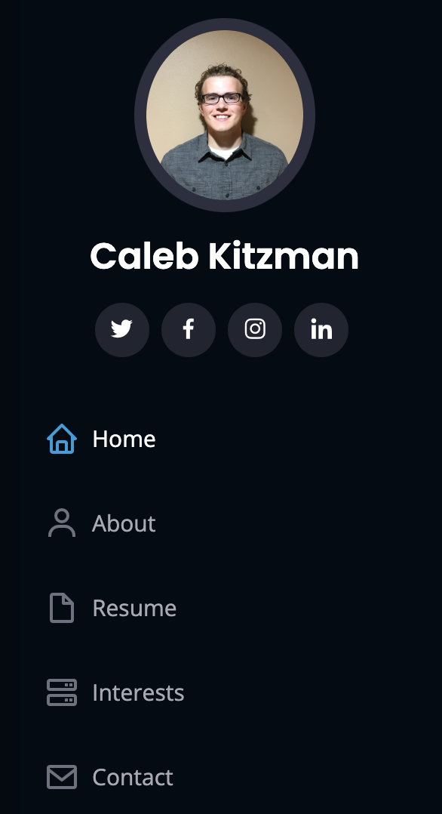
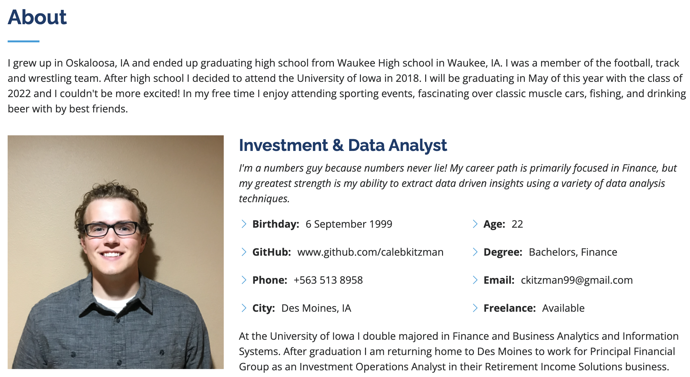
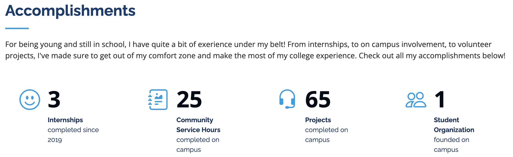
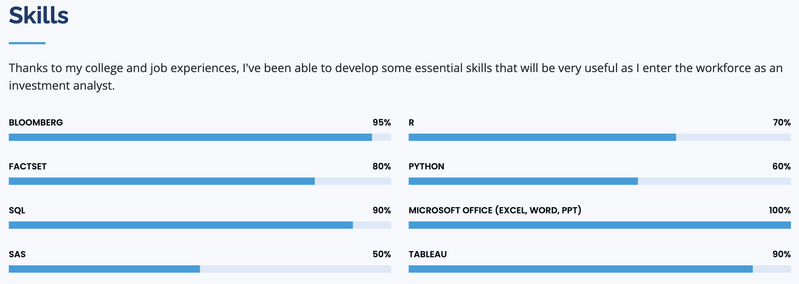
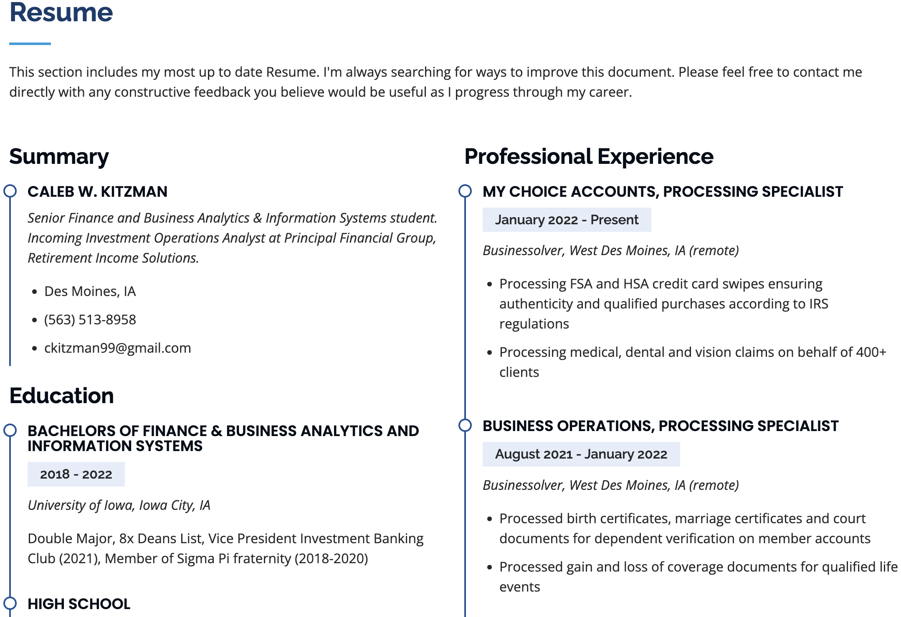
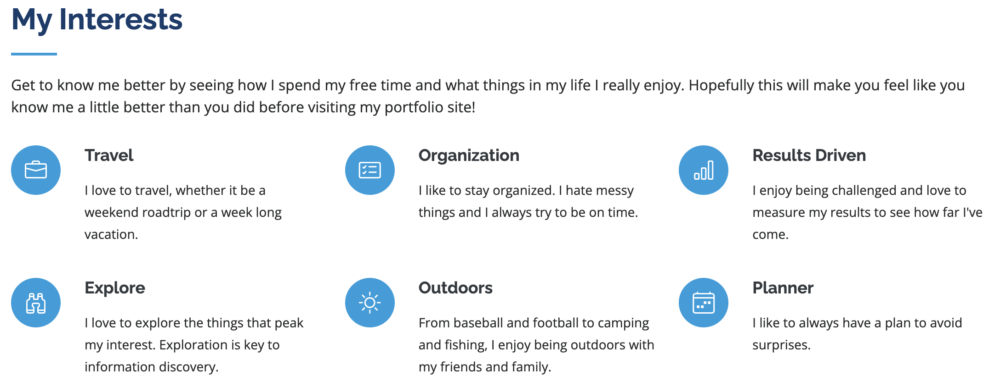
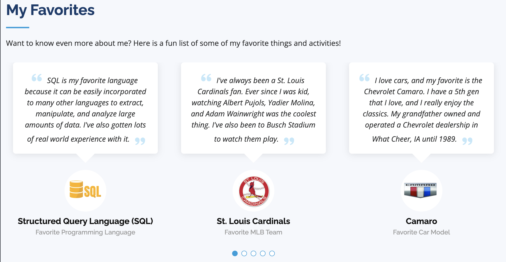
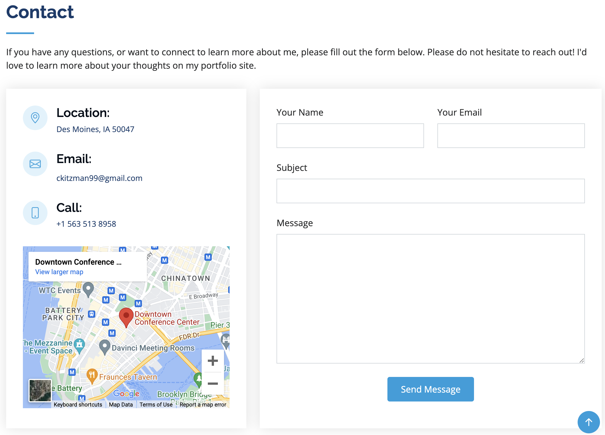

# My Personal Website
> This project revolves around creating my own web presence online. Utilizing a Boostrap template I have created my  own portfolio site that is all about me, my interests, and my accomplishments.
> Live demo [_here_](https://www.calebkitzman.com/).

## Table of Contents
* [General Info](#general-information)
* [Technologies Used](#technologies-used)
* [Features](#features)
* [Screenshots](#screenshots)
* [Setup](#setup)
* [Usage](#usage)
* [Project Status](#project-status)
* [Room for Improvement](#room-for-improvement)
* [Acknowledgements](#acknowledgements)
* [Contact](#contact)

## General Information
- Personal website with my own custom domain
- Established my online web presence
- Helped me learn to write my own HTML
- Application of CSS formatting

## Technologies Used
- Visual Studio Code - version 1.60.2
- Microsoft Azure - Static Web application
- NameCheap - Domain Name Registrar
- Google Analytics
- Bootstrapmade - Portfolio Template

## Features
- Photos
- Navigation Pane
- Social Media Links
- Google Maps API (work in progress)
- Contact Form (work in progress)
- Charts, Favicon, and images

## Screenshots

## Usage
The custom domain allows users to easily navigate to the web page at calebkitzman.com. Alias's have been set up to direct www.calebkitzman and the root page calebkitzman.com to the same underlying Azure web app. The original Azure url that the domains reference is located at black-cliff-048749210.1.azurestaticapps.net.

## Project Status
Project is: _in progress_

## Room for Improvement
Room for improvement:
- Background photo should not duplicate the photos added. Needs to be fit correctly.
- Duplicate favorites when full screen on desktop. Should only show the 5 favorites.

To do:
- Add Google Maps API link to Des Moines, not New York
- Add PHP contact form, so emails go directly to me (unavailable on free template, need to pay or create my own)

## Acknowledgements
- This project was inspired by Prof. Mike Colbert (Professor of Business Analytics and Information Systems, Tippie College of Business, The University of Iowa)
- This project was based on [this template](https://bootstrapmade.com/iportfolio-bootstrap-portfolio-websites-template/)

## Contact
Created by [@calebkitzman](https://www.calebkitzman.com/) - feel free to contact me!

